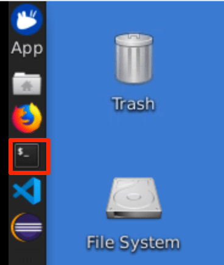
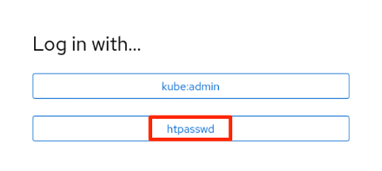
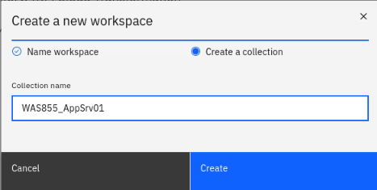
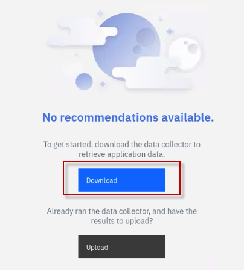
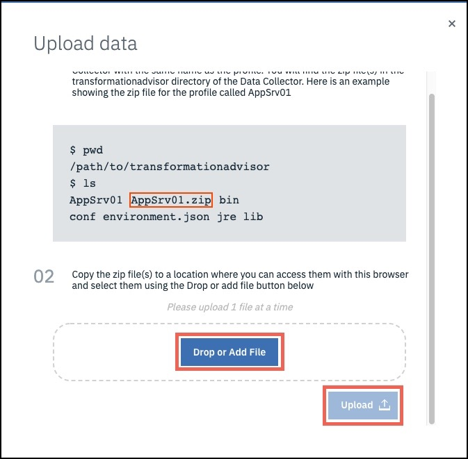
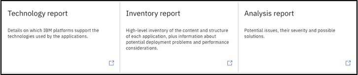
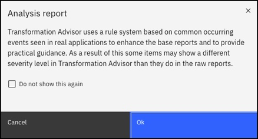

# Application Modernization Assessment using IBM Cloud Transformation Advisor

This demo covers how to use [IBM Cloud Transformation Advisor](https://www.ibm.com/cloud/garage/practices/learn/ibm-transformation-advisor) to analyze an existing traditional WebSphere application.

For this demo the WebSphere Liberty runtime is chosen as the target runtime and the intention is to migrate this application with minimal code changes. WebSphere Liberty is a fast, dynamic, and easy-to-use Java application server, built on the open source Open Liberty project. Ideal or the cloud, Liberty is a combination of IBM technology and open source software, with fast startup times (<2 seconds), no server restarts to pick up changes, and a simple XML configuration.

## Summary
This demo has the following steps:

* Pre-reqs to complete before the demonstration
* Access IBM Cloud Transformation Advisor
* Download the Data Collector
* Simulate running the Data Collector
* Upload the Data Collector results
* Analyze the Recommendations

## Pre-reqs to complete before the demonstration

It is assumed that you are using the **Teaching your monolith to dance** workshop environment for the demonstration. 
The environment runs in Skytap. 

Follow the instructions in the URL below to reserve an environment. 

1. Using the link below, open a new Browser window or tab. Then, follow the instructions to **reserve single environment** for the demonstration:

    [https://ibmtechsales.github.io/was-appmod/environments-setup/](https://ibmtechsales.github.io/was-appmod/environments-setup/)
	
	<br>

2. Start the Skytap environment if it is no already started

3.  After the VMs are started, click the **desktop VM** icon to access
    it.

    
     
    The Desktop Linux Desktop is displayed. You execute all the lab tasks
    on this desktop VM.

    <br/>

4.  Login with **ibmuser** ID.
    
      - Click on the **ibmuser** icon on the screen.
    
      - When prompted for the password for **ibmuser**, enter
        "**engageibm**" as the password:

      <br/>

    

    <br/>

5.  Resize the Skytap environment window for a larger viewing area while
    doing the lab. From the Skytap menu bar, click on the "**Fit to
    Size**" icon. This will enlarge the viewing area to fit the size of
    your browser window.

    

    <br/>

6.  Open a terminal window by clicking its icon from the Desktop
    toolbar.

    

    <br/>

6.  Clone the GitHub repo containing the lab workshop / demo artifacts. 

    a. In the terminal window, run the following command to clone the GitHub repository for this workshop / demo.
 
        git clone https://github.com/IBMTechSales/openshift-workshop-was
 
    **Sample output**
 
    
	
	<br/>

7.  Change to the cloned github directory where the materials are downloaded 
    
	    cd /home/ibmuser/openshift-workshop-was


    <br>

# The Demonstration Steps

## Access IBM Cloud Transformation Advisor

1. The Transformation Advisor is installed in the OpenShift cluster. For this demo, you use the following steps to access the Transformation
Advisor tool.

    - From web browser window, open a new Browser tab
    - Then click the **IBM Cloud Transformation Advisor** bookmark and login with the OpenShift account credentials.

      
	
	
    - If prompted to log in to Red Hat OpenShift Container Platform, click **htpasswd** field. Then log in with **ibmadmin**/**engageibm** as the username and password.

      
 
      
 
      The Transformation Advisor Home page is displayed.
 
       
	


## Download the Data Collector

Create a new Workspace and Collection and then download the **Data Collector** that will be used to examine the existing environment and applications.

1. Open IBM Cloud Transformation Advisor in a browser and click the button to **create a new Workspace**
    
    
  
    <br>

2. Enter a Workspace name such as `CustomerOrderServices` and click **Next**
    
    

    <br>
  
3. Enter a Collection name such as `WAS855_AppSrv01` and click **Create**
    
    
  
    <br>

4. When the **No recommendations available** page is displayed, click the **Download** data collector button
    
    
  
    <br>

5. When the **Data Collector** page is displayed, select the **Source Operating System** for your environment and click the **Download** button to download the Data Collector.
    

  This results in a file with a name similar to `transformationadvisor-Linux_CustomerOrderServices_WAS855_AppSrv01.tgz` being downloaded.


## Simulate running the Data Collector

In this demonstration it is not necessary to run the Data Collector, but it is important to understand what the steps would be.

1. Unzip the Data Collector zip file that was downloaded from IBM Cloud Transformation Advisor in the previous step. 
    
        cd /home/ibmuser/Downloads/
	
        tar xvfz transformationadvisor-Linux_CustomerOrderServices_WAS855_AppSrv01.tgz

     The archive is extracted to a sub-directly named similar to  `./transformationadvisor-2.4.4` 
   
     **Note:** the specific version may be different than the version illustrated above. 

     <br> 	 


2. It is necessary to modify the scan performed by the Data Collector to include the `org.pwte` package as the Data Collector doesn't scan `org.*` packages by default. Open the `conf/customCmd.properties` file and modify it as shown below:
  ```bash
  evaluation=--evaluate --excludePackages=com.ibm,com.informix,com.microsoft,com.sybase,com.sun,java,javax,net,oracle,sqlj,_ibmjsp --includePackages=org.pwte
  migration_liberty=--analyze --sourceAppServer=was855 --targetAppServer=liberty --targetCloud=dockerIBMCloud --includePackages=org.pwte --excludePackages=com.ibm,com.informix,com.microsoft,com.sybase,com.sun,java,javax,net,oracle,sqlj,_ibmjsp
  migration_was=--analyze --sourceAppServer=was855 --targetAppServer=was90 --targetCloud=vmIBMCloud --includePackages=org.pwte --excludePackages=com.ibm,com.informix,com.microsoft,com.sybase,com.sun,java,javax,net,oracle,sqlj,_ibmjsp
  #inventory=--inventory --excludeFiles=".*/directory/LargeXMLFileName.xml"
  #featureList=--featureList --excludeFiles=".*/directory/LargeXMLFileName.xml"
  #java_opt=-Xmx2g
  ```

3. Discuss the following command with the audience **it is not necessary to execute the command**. The command assumes that WebSphere Application Server v855 is installed to `/opt/IBM/WebSphere/AppServer855` with a **profile** named `AppSrv01` and that the **administration user** is `wasadmin` with a **password** of `wasadmin`. 
  ```
  ./bin/transformationadvisor -w /opt/IBM/WebSphere/AppServer855 -p AppSrv01 wasadmin wasadmin
  ```

4. If the Data Collector had been executed, it would create a zip file that includes the data collection results. That file has been provided for you. 

   Next, upload the AppSrv01.zip file into the IBM Cloud Transformation Advisor tool for analysis. 

## Upload the Data Collector results

In this section the results from the Data Collector will be uploaded to IBM Cloud Transformation Advisor.


1.  In the IBM Cloud Transformation Advisor web browser session, click the **WAS855_AppSrv01** link to go to the Recommendations page.

    

    <br/>

2. In the IBM Cloud Transformation Advisor web browser session, click the **Upload** button as shown below
   
    
	
    <br/>

3. When the **Upload data** dialog is displayed, use the **Drop or Add File** button to select the **Data Collector Results zip** file named `AppSrv01.zip` that was provided in this GitHub repo that you cloned in the setup section of the demo. 

     **Note:** The AppSrv01.zip file is located in `Home > ibmuser > openhift-workshop-was > shared` folder on the demo environment.  
   
     

     <br>

4. Click **Upload** to upload the data collection archive file to Transformation Advisor.
  
    

  After a few moments the upload of the data collector results will be completed.

## Analyze the Recommendations
Once the Data Collector Results have been uploaded to IBM Cloud Transformation Advisor a set of recommendations will be created and shown on the **Recommendations** page. In this section the recommendations will be analyzed and interpreted.

1. The Data Collector analyzed all of the applications running on the traditional WebSphere profile and displays a row in the chart for each application and potential target runtime.
  
    
  
    In the case of the **CustomerOrderServicesApp.ear** application, IBM Cloud Transformation Advisor has determined that the application can be modernized to run on **WebSphere Liberty** (which supports JEE6, 7 and 8) in 0.5 days. 

    <br>

2. Click on the **CustomerOrderServicesApp.ear** application name on the **WebSphere Liberty** row to see more information.

    <br>
	
3. Review the analysis results and scroll down to the **Complexity Rules** section and open the section. Note that IBM Cloud Transformation Advisor has determined that code changes **may be required** before this application will run on WebSphere Liberty.
  
    

    <br>

4. Scroll down to the **Issues details** section and open the section. Note that IBM Cloud Transformation Advisor has detected that there are **minor issues** with lookups for Enterprise JavaBeans, InitialContext lookups, and configuration in Docker containers. 
   Transformation Advisor also detected a **critical technology issue** with accessing the Apache Wink APIs.
   
    

    <br>

5. In order to review the IBM Cloud Transformation Advisor results in more detail, scroll to the bottom of the analysis page and click on the **Analysis Report** link
 
    
	
	<br>

6. When the warning dialog is displayed, click **OK**
  
    

    <br>

7. The **Detailed Migration Analysis Report** will be displayed which show the results of the migration rules that were executed by the Data Collector and returned results. Scroll down to the **Severe Rules** section and click on the **Show rule help** link for each of the results. Review the recommendations.
  
    

  **Behavior change on lookups for Enterprise JavaBeans** In Liberty, EJB components are not bound to a server root Java Naming and Directory Interface (JNDI) namespace as they are in WebSphere Application Server traditional. The fix for this is to change the three classes that use `ejblocal` to use the correct URL for Liberty

  **The user of system provided Apache Wink APIs requires configuration** To use system-provided third-party APIs in Liberty applications, you must configure the applications to include the APIs. In WebSphere Application Server traditional, these APIs are available without configuration. This is a configuration only change and can be achieved by using a `classloader` definition in the Liberty server.xml file.


## Final Analysis

The intention of this traditional WebSphere V855 --> WebSphere Liberty scenario is to migrate the Customer Order Services application to the cloud-ready new runtime with minimal code changes.

IBM Cloud Transformation Advisor was used to analyze the application for compatibility with WebSphere Liberty and determined that only small changes to three classes would be required.

While this scenario will move the application to the cloud-ready WebSphere Liberty runtime in a container, it will not **modernize** the application architecture and code in any way.
