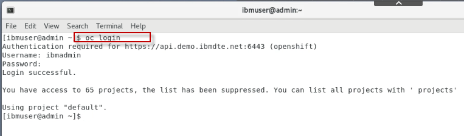

# Promote application deployment from Dev to Staging environment using GitOps (ArgoCD and Kustomize)

This demo covers how to promote (deploy) the application to Red Hat OpenShift **Staging** environment using ArgoCD provided by the Red Hat Operator hub. 

In the Coninuouus integration (CI) demo, you used OpenShift Pipelines (Tekton) to build and deploy the application to the OpenShift *Dev** environemnt. 

Once the application is tested and validated, the next logical step is to deploy the same application image to a staging environment for system testing.  

This domonstration showcases continuous deployment (CD) of the Liberty application via the Open Liberty Operator, Argo CD and a Kustomize. Kustomize allows you to define the deployment diferences between Dev and staging environments. These differeces are YAML snippts and stored in the GitOps git repo as **overlays** over the **base** depoyment configuration. 


## Summary
This demo has the following steps:

* Pre-reqs to complete before the demo starts
Configure the GitOps git repo
- Create the application in Git
- Clone the application code locally
- Create the application namespace in OpenShift
- Register the application with the Toolkit pipeline
- Push container imaage to staging namespace
- Configure Argo CD to monitor the GitOps repo
- Synch the repo with Argo CD to deploy the application
- Verify the application resources and deployed application
- Deploy version 2 of the applicaion using GitOps (Argo CD and Kustomize)
- Verify Version 2 deployment
- Review and Next Steps


## Pre-reqs to complete before the demonstration

It is assumed that you are using the **Teaching your monolith to dance** workshop environment for the demonstration. 
The environment runs in Skytap. 

Follow the instructions in the URL below to reserve an environment. 

1. Using the link below, open a new Browser window or tab. Then, follow the instructions to **reserve single environment** for the demonstration:

    [https://ibmtechsales.github.io/was-appmod/environments-setup/](https://ibmtechsales.github.io/was-appmod/environments-setup/)
	
	<br>

2. Start the Skytap environment if it is no already started

3.  After the VMs are started, click the **desktop VM** icon to access
    it.

    
     
    The Desktop Linux Desktop is displayed. You execute all the lab tasks
    on this desktop VM.

    <br/>

4.  Login with **ibmuser** ID.
    
      - Click on the **ibmuser** icon on the screen.
    
      - When prompted for the password for **ibmuser**, enter
        "**engageibm**" as the password:

      <br/>

    

    <br/>

5.  Resize the Skytap environment window for a larger viewing area while
    doing the lab. From the Skytap menu bar, click on the "**Fit to
    Size**" icon. This will enlarge the viewing area to fit the size of
    your browser window.

    

    <br/>

6.  Open a terminal window by clicking its icon from the Desktop
    toolbar.

    

    <br/>

7.  Login to the GitLab platform in the demo environment. 

    a. From the Firefox browser, click the **Gitlab** bookmark on the bookmark toolbar, or go to the following URL:
	
        http://gitlab.demo.ibmdte.net/users/sign_in
	
	b. Login to Gitlab. Username: **gitlabUser@mail.com** and Password: **passw0rd**. Then click **sign-in**
	
	  
	
		
8. Create a new project in Gitlab to serve as the gitOps repo 
	 
    a. Click the **Create a project** option
	
	b. Click **Import project**  
	
	c. Click the **Repo by URL** option as the *import from* source repo
	
	d. Complete the **import repo details** using the following values:  
	
	  - Git repository URL: **https://github.com/IBMTechSales/openshift-workshop-was.git**
	  - Project name: **cos-gitops-repo**
	  - Visibility leve: **Public**
	
       
	  
	  
	
	e. click the **Create Project** button.
	
	<br>
	
9.  Login to OpenShift. Type `oc login` to login to OpenShift. Use **ibmadmin** for the username and **engageibm** for the password.

    

    <br/>
	
	
10.  Login to OpenShift Console UI. 

    - From the browser, click the **openshift console bookmark** located on the bookmark toolbar and login with the **htpasswd** option.
	
      
	
	- Login to the OpenShift account with username **ibmadmin** and password **engageibm**
    
      
     
	<br/>

10. 

   
8.  Change to the cloned github directory where the pipelines materials are downloaded 
    
	```
	cd /home/ibmuser/openshift-workshop-was/labs/Openshift/DevopsManagement/tekton-pipeline
    
	```

    <br>	
	

# The Demonstration Steps

## Configure the GitOps repo
Create an instance of the `template GitHub GitOops repository` in your own GitHub account using the following steps:

1. Click [here](https://github.com/IBM/template-argocd-gitops/generate) to create an instance of the template (not that if a `404` error is displayed you will need to sign in to your GitHub account and then reload the page)

- Ensure that the `owner` field is set correctly, and then enter a unique `repository name`

- Leave the repository as a `public` repository and click **Create repository from this template**

  

### Clone the application code locally
The newly created repository will be shown in your browser. In order to clone the code locally, use the following steps

1. In the browser, click the green **Code** button and use the **copy* icon to copy the `https://github.com/...` URL

2. Navigate to a `directory/folder` on your local machine where you want to clone the code

3. Enter the following command, pasting the copied URL after the `git clone `:

```
git clone <URL>
```

4. Navigate in to the cloned code. The `folder` will have the same name as the `repository`

```
cd <REPO_NAME>
```

### Create the required branch in the repo
In this section you will create a branch named `test` and push the code back up to GitHub

1. Enter the following commands to create a new branch and push the changes back to GitHub:

```
git checkout -b test
git push -u origin test
```

### Configure a new `test` namespace
Create a new OpenShift project for the `test` namespace using the following steps

1. Issue the following command

```
igc namespace cos-with-toolkit-test
```

2. Issue the following command to allow the application image to be pulled from the `dev` namespace

```
oc policy add-role-to-group system:image-puller system:serviceaccounts:cos-with-toolkit-test -n cos-with-toolkit-dev
```

### Configure the pipeline for GitOps

1. Issue the following command to switch back to the `dev` namespace

```
oc project cos-with-toolkit-dev
```

2. Issue the following command to configure the required `ConfigMap` that will be used by the Pipeline

```
igc gitops
```

### Rerun the pipeline
Now that the GitOps repo is configured, you can rerun the pipeline and it will update the repo in the final step.

1. In the **OpenShift Container Platform UI**, select the `cos-with-toolkit-dev` project and navigate to **Pipelines --> Pipeline Runs**

2. Click the right-hand side menu button on the most recent Pipeline Run and select `Rerun`
  

3. Once the run has completed, check the **Log** for the `gitops` step to verify that it updated `test` branch ofthe GitOps repo
  

### Configure ArgoCD to monitor the GitOps repo
Now that the Pipeline has been validated, it is necessary to configure ArgoCD to monitor the GitOps repo

1. Issue the following command to bring up the Cloud Native Toolkit Dashboard:

```
igc dashboard
```

2. Click **ArgoCD**
  

3. Log in to ArgoCD using the **LOGIN VIA OPENSHIFT** button

4. Click **New App**

5. Enter the following information:
- Application Name: appmod-wiab-test
- Project: default
- Sync Policy: Manual
- Repository URL: <YOUR GITOPS REPO URL>
- Revision: test
- Path: cos-with-toolkit
- Cluster: https://kubernetes.default.svc
- Namespace: cos-with-toolkit-test

6. Click Create

### Sync the GitOps repo
Now that the application has been configured it can be synchronized with the Cluster.

1. Click the **Sync** button and **Synchronize** all of the resources
  

2. ArgoCD will now create and synchronize the required resources in the cluster
  

### Validate the application
Now that the pipeline is complete, validate the Customer Order Services application is deployed and running in `cos-with-tekton-test` project

- In the OpenShift Console, navigate to **Workloads --> Deployments** view and click on the `cos-with-toolkit` Deployment to view deployment details
  


- Next, navigate to the **Networking --> Routes** view and click on the **Location** to open a browser session for the application
  
