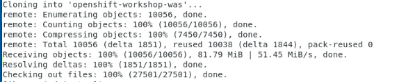
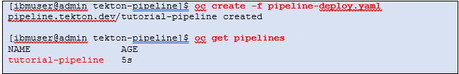

# OpenShift Pipelines with Tekton Demo

This demo covers how to use deploy the CustomerOrderServices application to Red Hat OpenShift using the OpenShift Pipelines.


## OpenShift pipelines

Red Hat OpenShift Pipelines is a cloud-native, continuous integration and continuous delivery (CI/CD) solution based on Kubernetes resources. 

It uses **Tekton** building blocks to automate deployments across multiple platforms by abstracting away the underlying implementation details. 
Tekton introduces a number of standard custom resource definitions (CRDs) for defining CI/CD pipelines that are portable across Kubernetes distributions.

For this demonstration, a collection of assets are provided that delivers a continuous integration solution for building and deploying your application within Red Hat OpenShift and Kubernetes. 


The diagram below shows the flow of the simple pipeline to build and deploy an application within Red Hat OpenShift. 

  

  - **Clone** your source code from GitHub and store it locally

  - **Build** the Docker image. Once the image is built, the image is **pushed** to a local image repository in OpenShift.

  - **Deploy** the containerized application to the Open Liberty runtime in OpenShift


## Summary

This demo has the following steps:

* Pre-reqs to complete before the demonstration
* Clone the application code locally
* Create an application project (namespace) in OpenShift
* Create the Pipeline resources in OpenShift
* Execute the OpenShift pipeline
* Validate the application
* Review and Next Steps


## Pre-reqs to complete before the demonstration

It is assumed that you are using the **Teaching your monolith to dance** workshop environment for the demonstration. 
The environment runs in Skytap. 

Follow the instructions in the URL below to reserve an environment. 

1. Using the link below, open a new Browser window or tab. Then, follow the instructions to **reserve single environment** for the demonstration:

    [https://ibmtechsales.github.io/was-appmod/environments-setup/](https://ibmtechsales.github.io/was-appmod/environments-setup/)
	
	<br>

2. Start the Skytap environment if it is no already started

3.  After the VMs are started, click the **desktop VM** icon to access
    it.

    
     
    The Desktop Linux Desktop is displayed. You execute all the lab tasks
    on this desktop VM.

    <br/>

4.  Login with **ibmuser** ID.
    
      - Click on the **ibmuser** icon on the screen.
    
      - When prompted for the password for **ibmuser**, enter
        "**engageibm**" as the password:

      <br/>

    

    <br/>

5.  Resize the Skytap environment window for a larger viewing area while
    doing the lab. From the Skytap menu bar, click on the "**Fit to
    Size**" icon. This will enlarge the viewing area to fit the size of
    your browser window.

    

    <br/>

6.  Open a terminal window by clicking its icon from the Desktop
    toolbar.

    

    <br/>

7.  Clone the GitHub repo containing the lab workshop / demo artifacts. 

    a. In the terminal window, run the following command to clone the GitHub repository for this workshop / demo.
 
        git clone https://github.com/IBMTechSales/openshift-workshop-was
 
    **Sample output**
 
    
	
	<br/>

   
8.  Change to the cloned github directory where the pipelines materials are downloaded 
    
	```
	cd /home/ibmuser/openshift-workshop-was/labs/Openshift/DevopsManagement/tekton-pipeline
    
	```

    <br>	
	
9. You will find the following pipeline resources in the **tekton-pipeline** folder:

    - **git-clone.yaml** - Creates the Tekton task to clone a Git repo from a given URL and loads a Workspace
    - **buildah.yaml** – Creates the build and push Tekton tasks
    - **oc-deploy.yaml** – Creates the Tekton deployment Task to deploy the application to OpenShift
    - **pipeline-deploy.yaml** – Creates the pipeline that invokes the tasks defined
    - **pipeline-deploy-run.yaml** – Runtime execution of the pipeline to build and deploy the app
    
	<br>
	
10.  Login to OpenShift. Type `oc login` to login to OpenShift. Use **ibmadmin** for the username and **engageibm** for the password.

     

     <br/>


11.  Login to OpenShift Console UI. 

    - From the browser, click the **openshift console bookmark** located on the bookmark toolbar and login with the **htpasswd** option.
	
	- Login to the OpenShift account with username **ibmadmin and password engageibm
    
	
	
     
	<br/>


# The Demonstration Steps


## Create an application namespace for the Dev environment

1. Create a new OpenShift project for the `dev` namespace using the following steps

    ```
    oc new-project dev
    ```

## Create the Pipeline resources in OpenShift

The Pipeline resources are defined in YAML files. In this demonstration, the YAML files have been provided for the tasks and pipeline resources.

  - **git-clone.yaml** - Creates the Tekton task to clone a Git repo from a given URL and loads a Workspace
  - **buildah.yaml** – Creates the build and push Tekton tasks
  - **oc-deploy.yaml** – Creates the Tekton deployment Task to deploy the application to OpenShift
  - **pipeline-deploy.yaml** – Creates the pipeline that invokes the tasks defined
  - **pipeline-deploy-run.yaml** – Runtime execution of the pipeline to build and deploy the app
  

In the Terminal window, ensure you are at the following folder, then create the pipeline resources listed above, as illustrated below:

`/home/ibmuser/openshift-workshop-was/labs/Openshift/DevopsManagement/tekton-pipeline`


1. Create the git-clone task

    ``` 
    oc create -f git-clone.yaml
    
    oc get tasks
	
    ```
    The **git-clone** task is created

    
	
	<br>
	
2. Create the buildah task

    ``` 
    oc create -f buildah.yaml
    
    oc get tasks
	
    ```
    The **buildah** task is created

    
	
	<br>
	
3. Create the deployment task

    ``` 
    oc create -f oc-deploy.yaml
    
    oc get tasks

    ```

    The **deployment-cm** task is created

    
	
    <br>

4. Create the pipeline

    ``` 
     oc create -f pipeline-deploy.yaml

     oc get pipelines

    ```

    The **tutorial-pipeline** pipeline is created

    	
		
	

## Run the pipeline

An instance of a pipeline is known as a **pipelineRun**.  

A **PipelineRun** starts a **Pipeline** and ties it to the Workspace containing all required resources. It automatically creates and starts the TaskRuns for each Task in the Pipeline.

1. Run the pipeline to build and deploy the CustomerOrderServices application within OpenShift, in the `dev` namespace.
    ```
    oc create -f pipeline-deploy-run.yaml

    ```  
	
    
	
	
### Verify the pipeline is running

An instance of the pipeline was executed at the completion of the pipeline configuration in the previous step.

- In the **OpenShift Container Platform UI**, select the `dev` project and navigate to **Pipelines --> Pipeline Runs**

  
  
 - Click on the **name** of the running Pipeline Run, see the tasks that are being executed, which are finished, and the status of the tasks.

  

- Select the **Logs** tab and watch the pipeline run the tasks. 

  

- Return to the **Details** view for the pipeline. Then click on the `deploy-to-cluster` task. 
  
  
  
-  When the task completes, you will see the logs indicate that the application is deployed to OpenShift.

  


### Validate the application

Now that the pipeline is complete, validate the Customer Order Services application is deployed and running in `dev` project

- In the OpenShift Console, navigate to **Workloads --> Deployments** view and click on the `cos` Deployment to view deployment details

  


- Next, navigate to the **Networking --> Routes** view and click on the **Location** to open a browser session for the application
  
  


- Add `/CustomerOrderServicesWeb` to the end of the URL in the browser to access the application

  

- Log in to the application with `username: skywalker` and `password: force`

  

