# Devops Management - Using OpenShift pipelines (Tekton) for CI/CD of microservices to RedHat OpenShift Container Platform

## 1.1 Introduction 

In this lab exercise, we will deploy a cloud native application to an OpenShift cluster using OpenShift Pipelines (Tekton).

This is a step-by-step guide to walk you through an example of how to create a Tekton pipeline to automate the build, push, and deploy a Java application based on OpenLiberty containers on OpenShift.

This example uses **Buildah** as the docker build engine. There are other options for the docker build engine, so it should be noted that this is not the only way to accomplish this task.

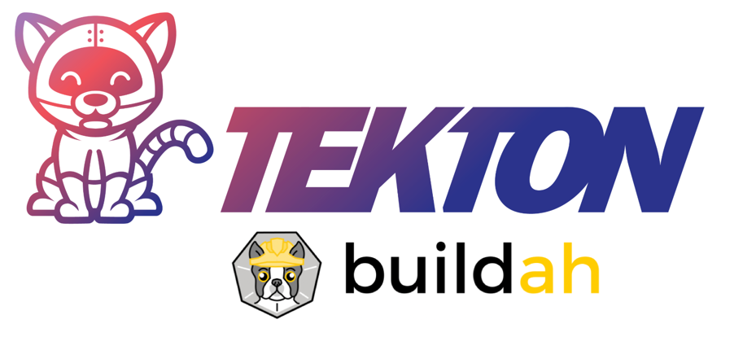

## 1.2 What is all this Tekton stuff?

Tekton defines a set of Kubernetes custom resource definitions (CRD) as standard constructs for creating Continuous Integration and Continuous Delivery (CI/CD) pipelines.

The following is a brief introduction to the Tekton CRDs.

  - **Task**: A sequence of commands (steps) that are run in separate containers in a pod

  - **Pipeline:** A collection of tasks that are executed in a defined order

  - **TaskRun:** Runtime representation of an execution of a task

  - **PipelineRun:** Runtime representation of an execution of a pipeline

Let’s investigate a bit more detail what makes up a Tekton Pipeline. As explained above, all objects within a Tekton pipeline are Kubernetes objects.

**Pipelines** have **tasks**, which are a CRD that runs a container.

Within the **task** you define **steps**, which are commands that you will run inside the container.

**Pipelines** normally have **resources** associated with them, which can be accessed by all tasks within that pipeline.

It should be noted that tasks can be used within multiple pipelines, so it's good practice to use pipeline resources to define the resources used, such as GitHub repositories or docker hub image definitions.

## 1.3 What exactly are we building here?

Here, you will deploy a Tekton Pipeline and three Task objects.

1.  **Clone** your source code from GitHub and store it locally

2.  **Build** the Docker image. Once the image is built, the image is **pushed** to a local image repository in OpenShift.

3.  **Deploy** the containerized application to the Open Liberty runtime in OpenShift

Here is a diagram of what you are going to build in this lab.

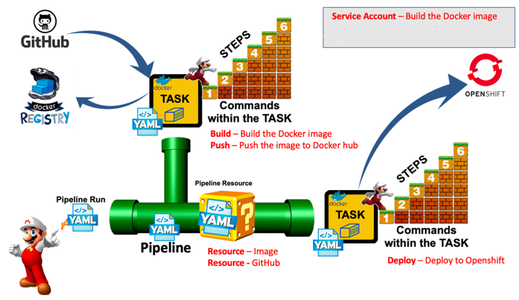

# 1.4 Lab Tasks

## 

## **1.4.1 Let’s get started** 

First, launch the lab environment and login to the VM.

1.  If the VM is not already started, start it by clicking the Play button.
    
    

2.  After the VM is running (this may take several minutes), click the **desktop** VM to access it.
    
    

3.  Login with the ibmuser user using the password engageibm.
    
    

4.  Resize the Skytap environment window for a larger viewing area while doing the lab. From the Skytap menu bar, click on the **Fit to Size** icon. This will enlarge the viewing area to fit the size of your browser window.
    
    

5.  Open a new terminal window from the VM desktop.
    
    

## **1.4.2 Clone the Git repository used for this lab and explore the contents**

1.  Clone the **devops-management** GitHub repository to the local VM.
    
    a.  Open a Terminal window on the VM, and ensure you are in the home directory of the user “ibmuser”
        
        cd /home/ibmuser
    
    b.  From the terminal window, run the following commands to clone the repo:
        
        **git clone** https://github.com/kellyyfoo/devops-management
        
      
        
      These commands above clone the public repo named **devops-management** to the local directory under **/home/ibmuser/devops-management** directory.
    
    c.  Change to the cloned directory
        
        cd /home/ibmuser/Devops-management
    
    d.  List the directory contents using the `ls` command
        
    You will find the following key resources:

       - **Dockerfile** – Used to build the application on the Liberty runtime

       - **app** – The Customer Order Services application

       - **deploy** - Used to handle deployment of the application

       - **tekton-pipeline** (folder) – YAML files to create the Pipeline resources for this lab
    
    
    
    In the GitHub repo, you will find all the YAML files in the **tekton-pipeline** sub folder.

     

2.  Enter `cd tekton-pipeline` then type `ls` to go to the lab directory and list the contents.
    
    In the **devops-management/tekton-pipeline** directory, you will find all the YAML files needed to create the Tekton pipeline resources to build and deploy the application to OpenShift.
    
    

    You will find the following key resources:

    - **git-clone.yaml** - Creates the Tekton task to clone a Git repo from a given URL and loads a Workspace

    - **buildah.yaml** – Creates the build and push Tekton tasks

    - **oc-deploy.yaml** – Creates the Tekton deployment Task to deploy the application to OpenShift

    - **pipeline-deploy.yaml** – Creates the pipeline that invokes the tasks defined

    - **pipeline-deploy-run.yaml** – Runtime execution of the pipeline to build and deploy the app

## **1.4.3 Login to OpenShift and create a new project for this lab**

1.  Type `oc login` to login to OpenShift. Use ibmadmin for the username and engageibm for the password.

     

      

2.  Type `oc new-project dev` which will create a new project named dev, and switch your context to that project

<table>
<tbody>
<tr class="odd">
<td></td>
<td>
<strong>Note:</strong>

Ensure you create the new project with the name “<strong>dev</strong>”.

Otherwise, you will be required to review and modify all YAML files that reference this OpenShift project (Namespace), prior to running the YAML files to create the pipeline resources
</td>
</tr>
</tbody>
</table>

> 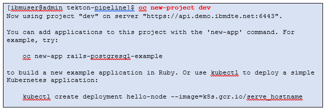

## **1.4.4 OpenShift Service Account and Secret with Login Token**

It is good OpenShift practice to create a [service account](https://docs.openshift.com/container-platform/3.11/dev_guide/service_accounts.html) for your applications. A **service account** provides an identity for processes that run in a Pod.

The OpenShift Pipelines Operator has already been setup in your VM. This operator conveniently creates and configures a service account named **pipeline** for us that has permission to build and push images. This enables us to deploy apps to OpenShift and allows the pipeline to create pods when it is run.

Usually, we would have to manually grant our service account permission to run pipelines, deploy apps to OpenShift, and push images to the image registry, but this has already been set up.

Additionally, OpenShift [secrets](https://docs.openshift.com/container-platform/3.7/dev_guide/secrets.html) are used to hold private information that could be sensitive including data such as passwords. A secret has already been created for this service account with the token required to login and execute deployment during the pipeline run.

## **1.4.5 Create the Tekton task to clone a repo into your Workspace**

Now, you will create the Tekton task that works with Git repositories so that other tasks in your Pipeline can use them.

This **git-clone** task clones a Git repo from a provided URL into the **output** Workspace so that other tasks can access it.

By default, the repo is cloned into the Workspace's root directory but can be cloned into a different subdirectory by setting the Task's subdirectory parameter.

For this lab, we will simply use the master branch of the repo, but we can also checkout different repo branches, tags, etc. with the Task's revision parameter.

1.  Ensure the **Terminal** window is in the **/home/ibmuser/devops-management/tekton-pipeline** directory, where the Pipeline YAML files are located.
    
        cd /home/ibmuser/devops-management/tekton-pipeline

2.  Review the contents of **git-clone.yaml**
    
        gedit git-clone.yaml

    - The name of the Task Resource is **git-clone**

    - The git repo is cloned into the root of the **output** Workspace

    - The **url** to the source git repo is passed through the “**url**” parameter.

    - Different branches, tags, etc. to checkout are passed through the "**revision**" parameter.
    
       
    
    **Note: Do NOT MODIFY the YAML for this lab\!**
    
    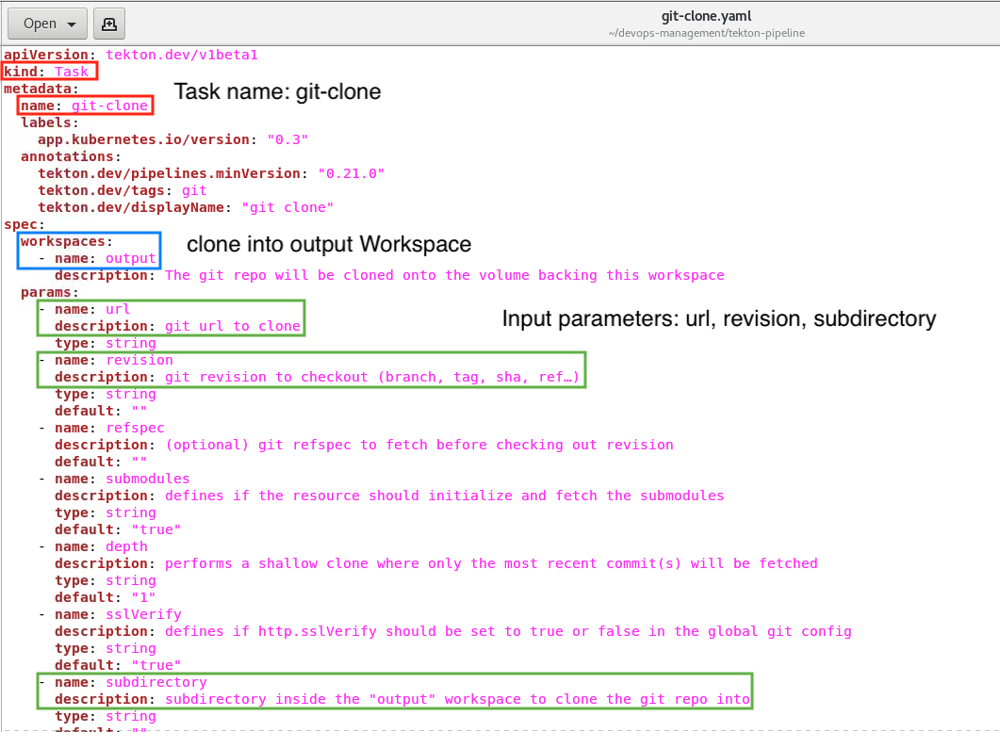
    
    a.   **Close the Gedit editor** when you have finished reviewing the contents**.**
        
     &nbsp;&nbsp;&nbsp;&nbsp;**DO NOT SAVE ANY CHANGES\!**

      

3.  Create the Task, using the git-clone.yaml file, then list the new “git-clone” task.
    
        oc create -f git-clone.yaml
    
        oc get tasks
    
      

## **1.4.6 Create a Tekton Task to build the Docker image, and push the image to the OpenShift Image Registry**

Now, you are ready to create the Tekton **Task** that build the container image and push it to the internal OpenShift image registry**.** The task includes two steps:

  - **build** the docker image from the source GitHub repo

  - **pushes** the image to the OpenShift image registry
    
  For this lab, you will use **buildah**. (<https://buildah.io/>)
    
  **Buildah** is a command-line tool for building Open Container Initiative-compatible (that means Docker- and Kubernetes-compatible, too) images quickly and easily.
    
  **Buildah** is easy to incorporate into scripts and build pipelines.

<!-- end list -->

1.  Review the **buildah.yaml** file using gedit command. **DO NOT MODIFY THE FILE**
    
        gedit buildah.yaml

    The Task resource defines its spec:

    - The source Workspace

    - Local parameters used during the execution of the task

    - Steps. In this example, “**build**” and “**push**” is described

    - The image used for the task execution. here, it is **quay.io/buildah/stable**.

    - The commands to execute in the “build” and “push” steps. The first one builds the image, the second pushes it to the target repository.

    In general, steps are used to isolate individual commands, and illustrated below.
 
      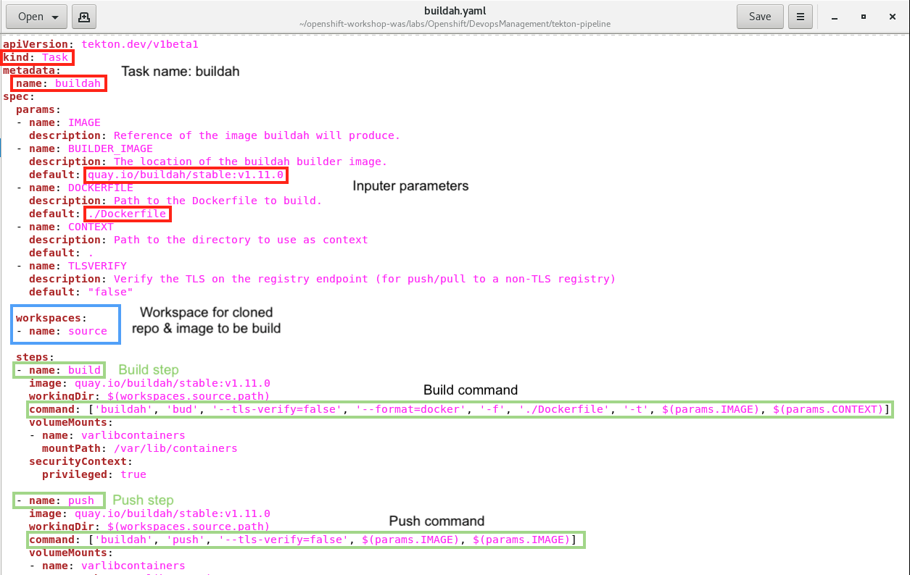
	  
	   

2.  **Close the Gedit editor** when you have finished reviewing the contents**.**
    
    **DO NOT SAVE ANY CHANGES\!**

     

3.  Create the Task, using the buildah.yaml file, then list the new “buildah” task.
    
        oc create -f buildah.yaml
    
        oc get tasks
    
       

## **1.4.7 Create the Deployment Task**

To manage the deployment of this application, tasks are needed to specify a **Deployment** (controller for pods) in OpenShift.

The **oc-deploy.yaml** file defines a Tekton **Task** that in turn invokes a command to run **deploy/overlays/dev** to create the deployment.

To enable this action, each task will define a step using the **image-registry.openshift-image-registry.svc:5000/openshift/cli:latest** image registry.

1.  Review the **oc-deploy.yaml** file using cat command. **DO NOT MODIFY THE FILE**
    
        cat oc-deploy.yaml
    
      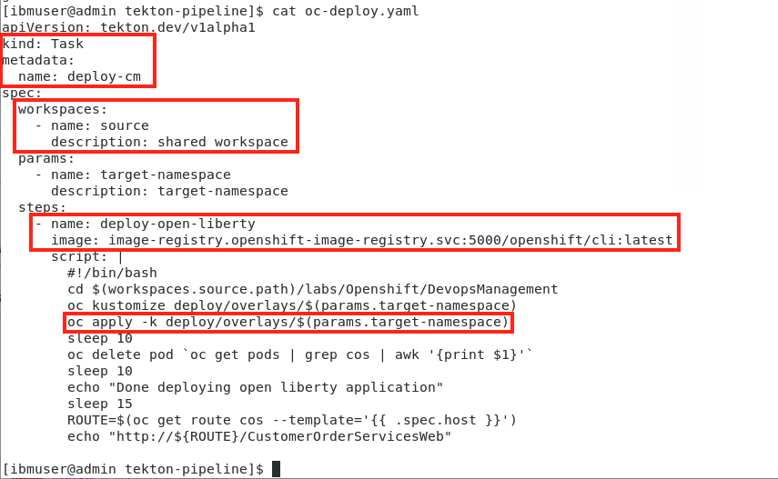

       

2.  The **deploy/overlays/dev** invoked by **deploy-cm** is used to create the deployment for the application.
    
    **Note:** The deploy task leverages capabilities from a tool called “**Kustomize**” by Google. Kustomize is installed with OpenShift in the lab environment. A Brief introduction to Kustomize is provided in the next section of the lab.

     

3. Run the **oc-deploy.yaml** to create the Tekton Deployment Task. Then, list the new task.
    
        oc create -f oc-deploy.yaml
    
        oc get tasks

      

## **1.4.7.1 Brief Introduction to Kustomize**

As seen in the oc-deploy.yaml , the deploy task leverages a tool called **Kustomize,** with OpenShift.

Kustomize lets you customize raw, template-free YAML files for multiple purposes, leaving the original YAML untouched and usable as is. kustomize targets kubernetes; it understands and can patch [kubernetes style](https://kubernetes-sigs.github.io/kustomize/api-reference/glossary#kubernetes-style-object) API objects.

Kustomize is very useful in the common use case where you’ll need multiple variants of a common set of resources across multiple environments: , e.g., a *development*, *staging* and *production* variant.

For this purpose, **kustomize** supports the idea of an *overlay* and a *base*. Both are represented by a kustomization file. The **base** declares things that the variants share in common (both resources and a common customization of those resources), and the **overlays** declare the differences.

Here’s a file system layout to manage a *staging* and *production* variant of a given cluster app:

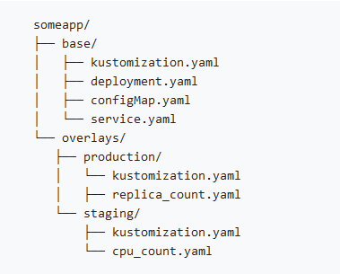

In this lab, the base directory includes the **kustomize.yaml** and the OpenLiberty application yaml. We have an overlay folder named “**dev**” that includes the overrides for deploying the application to the “dev” namespace.

The overlays include two customizations over the base configuration:

  - The **dev** namespace is applied to all resources.

  - The **ApplicationImage** in the OpenLiberty YAML is updated to the image tagged for “dev”

To learn more about Kustomize, refer to the following resources:

<https://kubernetes.io/blog/2018/05/29/introducing-kustomize-template-free-configuration-customization-for-kubernetes/>

<https://kustomize.io/>

## **1.4.8 Create the Pipeline that invokes the build/push and deploy Tasks you created**

Now that the tasks have been created, they can be incorporated and orchestrated in a Pipeline. The pipeline in the lab does the following:

  - First, the pipeline runs the **git-clone** task that clones from the git repo URL

  - Next, the pipeline runs the **buildah** task that performs the **build** and **push** steps

  - Once the build-push task completes, the **deploy-cm** task is executed to deploy the app to OpenShift

  - The pipeline orchestrates the order of the task execution using the **runAfter** tag in the pipeline definition. If the build-push task fails, the deploy task will not run.

<!-- end list -->

1.  Review the **pipeline-deploy.yaml** file

        cat pipeline-deploy.yaml

    Snippet showing the tasks in the pipeline-deploy.yml file

    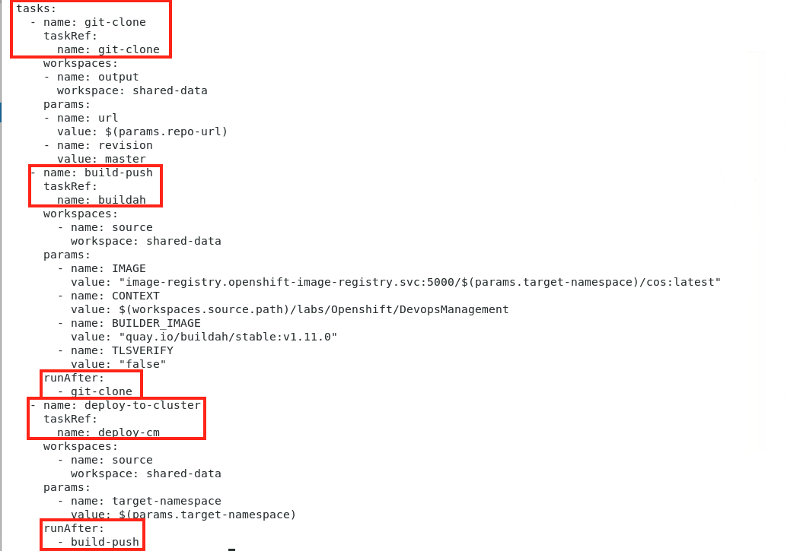

     

2.  Use the pipeline-deploy.yaml file to create the pipeline. Then, list the new pipeline

        oc create -f pipeline-deploy.yaml

        oc get pipelines

     

## **1.4.9 Run the Pipeline**

To execute the pipeline, a **PipelineRun** artifact should be created.

A **PipelineRun** starts a **Pipeline** and ties it to the Workspace containing all required resources. It automatically creates and starts the TaskRuns for each Task in the Pipeline.

1.  Review the **pipeline-deploy-run.yaml** file

        cat pipeline-deploy-run.yaml

    The **PipelineRun** identifies the pipeline to run, and provides the workspace and parameters used during its execution. It also defines the **Service Account** that runs the pipeline.
 
    

     

2.  Execute the PipelineRun using the YAML file

        oc create -f pipeline-deploy-run.yaml

      

    Next, let’s do some basic queries to ensure the pipeline is executing. Then, you will launch the OpenShift console to view the PipelineRun.

    A fully completed and successful **pipelineRun** will result in the pod states below.

    **Note:** It may take 10 minutes to run the pipeline, as it builds the docker image for the app, pushes the image to the OpenShift image registry, and deploys the application.

      - The **cos-<pod ID\>** is the application that was deployed via the pipeline. This pod MUST be **running**, as it is the cos application that was deployed.

      - The **tutorial-pipeline-run-1-build-push** pod is the pod that ran the build/push tasks

      - The **tutorial-pipeline-run-1-deploy-to-cluster** pod is the pod that ran the deploy task

      - The **tutorial-pipeline-run-1-git-clone** pod is the pod that ran the clone Git repo task

    

## **1.4.10 Access the OpenShift console to view the PipelineRun status and logs**

1.  Access the OpenShift console.
    
    a.  Click the Firefox browser icon located on the VM desktop.
        
      
    
    b.  From the browser, click the **openshift console** bookmark located on the bookmark toolbar and login with the **htpasswd** option.
        
      
        
    c. Login to the OpenShift account with username **ibmadmin** and password **engageibm.**
        
      

       

2.  From the OpenShift console, go the **Pipelines** tab and click on **Pipelines**. Use the **Project** drop down menu and select the **dev** project.
    
    

     

3.  Find the pipeline with name **tutorial-pipeline,** and click on its last run named **tutorial-pipeline-run-1** to view its details.
    
    

     

4.  The pipeline run's details should be displayed on the resulting page. Its **git-clone**, **build-push**, and **deploy** steps are show.
    
    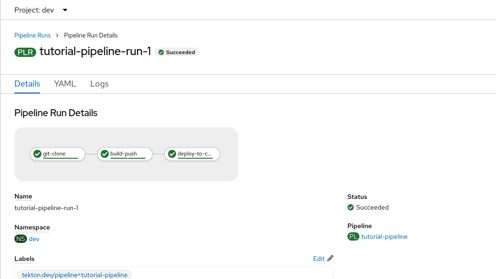

     

5.  Click on the **Logs** tab to see the logs outputted by each of the steps.
    
    

## **1.4.11 Validate the application is deployed and runs as expected**

Upon successful completion of the pipeline, the sample application is deployed to OpenShift.

In this section, you will view the application resources that were deployed to OpenShift and validate the sample application runs as expected.

1.  Use the following commands to verify the application is deployed and the pod is running
    
        oc get deployments
    
        oc get pods | grep cos
    
    

     

2.  Use the following commands to verify the service was created
    
        oc get services
    
    
	
	 

3.  Test the application from the web browser. Return to the OpenShift console and scroll to the end of the logs of the **deploy-to-cluster** step. Copy the URL that is displayed on the last line:
    
        http://cos-dev.apps.demo.ibmdte.net/CustomerOrderServicesWeb
    
    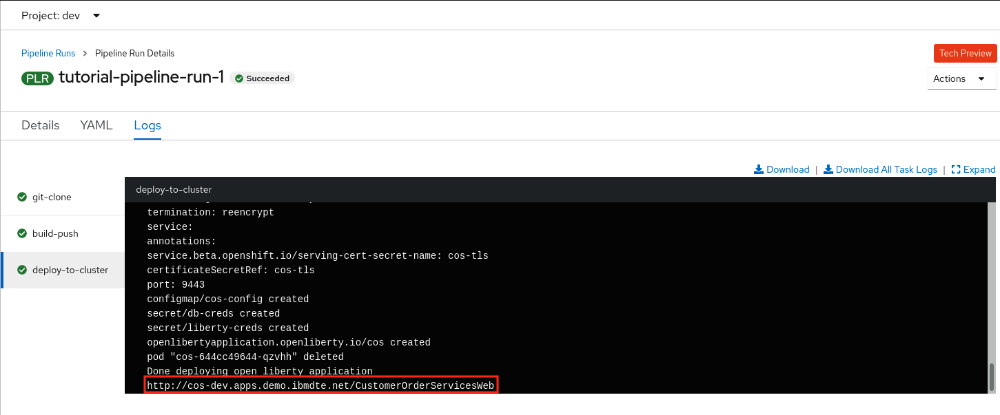

	 

4. Open this URL in a new tab. You will be prompted to login in order to access the application. Enter username **skywalker** and password **force**

    

     

5. The application page titled **Electronic and Movie Depot** will be displayed. From the **Shop** tab, click on a movie and on the next pop-up panel, drag and drop the item into the shopping cart.

    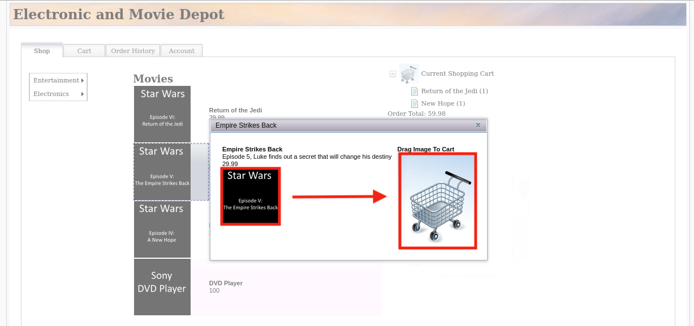

	 

6. Add a few items to the cart. As the items are added, they'll be shown under **Current Shopping Cart** and **Order Total will be updated.**

    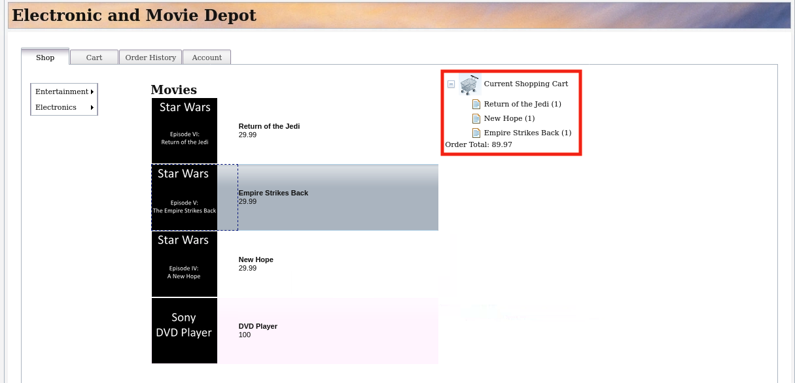

	 

# 1.5 Conclusion

**Congratulations!** 

You have completed the lab and are on your way to developing robust pipelines for CI/CD of your application deployments using containers and RedHat OpenShift Container Platform.

In this lab, you learned how to create the Tekton resources to automate CI/CD for microservices deployed to OpenShift.

  - Task

  - Pipeline

  - PipelineRun

##  End of Lab: Using Tekton pipelines for CI/CD of microservices to RedHat OpenShift Container Platform

-----------------------------------------------------------------------------------------------------------

  

# Appendix: SkyTap Tips for labs

## **How to use Copy / Paste between local desktop and Skytap VM** 

Using copy / Paste capabilities between the lab document (PDF) on your local workstation to the VM is a good approach to more efficiently work through a lab, while reducing the typing errors that often occur when manually entering data.

1.  In SkyTap, you will find that any text copied to the clipboard on your local workstation is not available to be pasted into the VM on SkyTap. So how can you easily accomplish this?
    
    a.  First copy the text you intend to paste, from the lab document, to the clipboard on your local workstation, as you always have (CTRL-C)
    
    b.  Return to the SkyTap environment and click on the Clipboard at the top of the SkyTap session window.

    

     

    c.  Use **CTRL-V** to paste the content into the Copy/paste VM clipboard. Or use the **paste** menu item that is available in the dialog, when you right mouse click in the clipboard text area.

    
   
     

    d.  Once the text is pasted, just navigate away to the VM window where you want to paste the content. Then, use **CTRL-C**, or right mouse click & us the **paste menu item** to paste the content.

    

    e.  The text is pasted into the VM

    

**Note:** The very first time you do this, if the text does not paste, you may have to paste the contents into the Skytap clipboard twice. This is a known Skytap issue. It only happens on the 1st attempt to copy / paste into Skytap.
