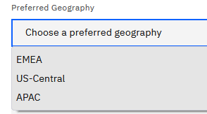
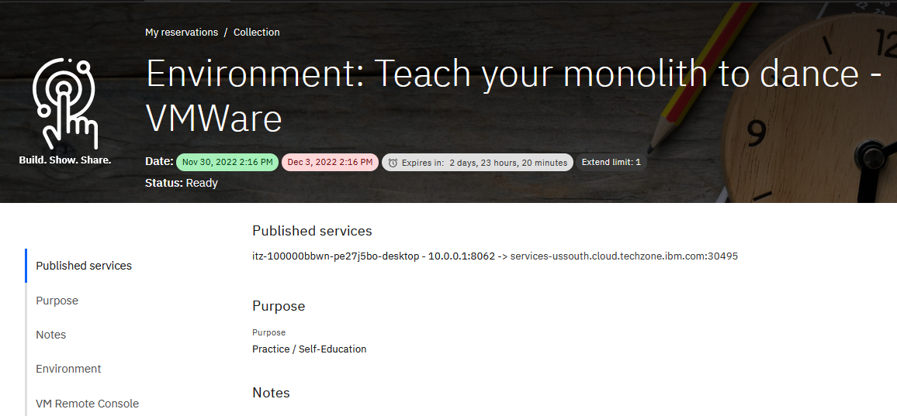
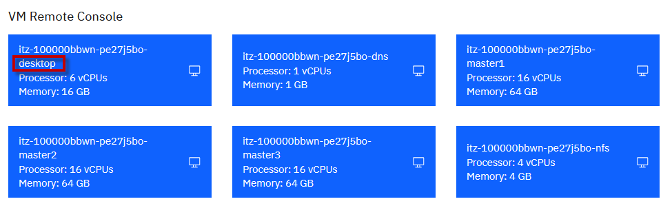
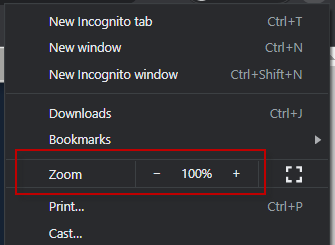
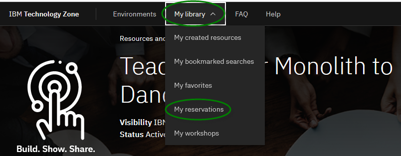

# Reserve a single environment for demos or self-enablement

Need support? Contact **Kevin Postreich**, **Yi Tang**

|         |           |  
| ------------- |:-------------|
|    | <strong>IMPORTANT:</strong>    A VMWare on IBM Cloud lab environment is provided for the labs/demos in this asset.   Environment reservations are immediate and can be reserved for up to 3 days, and extended up to 8 days duration.   Use the instructions below to reserve your demo/lab environment. 

1.  Use the link below to access the **Teach Your Monolith to Dance** workshop environment reservations page.  

    <https://techzone.ibm.com/my/reservations/create/6387aa80eb61a800183d69d3>

    a.  Use your **IBM ID** to login to the IBM Technology Zone

    b.  The **Create a reservation** page is displayed

     
	 
	  

2.  Select “**Reserve for Now**” Radio button, and then follow the
    on-screen dialog to reserve an environment in a VMWare on IBM Cloud data center in the closest Geography (US-Central, EMEA, Asia Pacific)
    
    a.  The environment **name** should be pre-filled with “**Environment: Teach your monolith to dance - VMWare**”
    
    b.  **Purpose**: Select a `purpose` from the drop-down menu
	
	 
    
    c.  **Customer name(s)**: If, in the "Purpose" field, you selected `demo`, `proof of technology` or `proof of concept`, then customer name(s) is a required field. Enter customer name(s).
	
	d.  **Description**: Enter a description. The field is required.
    
    e.  **End date and time**: Use the calendar widget and select the
        maximum date available (3 days, and can be extended up to 8 days)
    
    f.  **Select a time**: Select a time of day for reservation to
        expire
    
    g.  Select a **timezone** nearest to you

    

     

3.  Preferred Geography: Choose an IBM Cloud datacenter in the closest
    geography (US, EMEA, Asia Pacific)

    
	
	 
	
4.  Once complete, click on the “**Submit**” Button

     
  
5.  The reservation takes a moment to be created. When it is created,
    click on the “**My reservations**”
     button to see the detail so of
    the environment reservation.

    **Note:** The details of your environment reservation are displayed.

     **Note:** It will take several minutes (maybe 30 minutes) for the environment to get to the **Ready** state.

     

6. When the demo environment is provisioned, the status is changed to **Ready**:

    a. Click on the Environment reservation to open the details page. 

    

    b. The environment details page is displayed. 
   
    

# Accessing the lab environment

The lab environment contains six (6) Linux VMs.

The Ubuntu Linux **desktop** VM is the VM that you will access in the lab thorugh a published service.  

 

    

1.  Access the lab environment from your web browser. 
    
    A Published Service is configured to provide access to the **Workstation** VM through the noVNC interface for the lab environment.
    
    a. When the environment is provisioned, right-mouse click on the **Published Service** link and open the URL in a new private or incognito browser window, as described below:  
    
    - If using **Google Chrome** browser, select **"Open link in incognito window"** from the context menu. 

      
    
    - If using **Firefox** browser, select **"Open link in new private window"** from the context menu. 

      

    b. Click on the **"vnc.html"** link to open the lab environment through the **noVNC** interface. 

      

 
    c. Click the **Connect** button 
    
      

    d. Enter the password as:  **passw0rd**. Then click the **Send Credentials** button to access the lab environment. 

    > Note: That is a numeric zero in passw0rd  

      
	  
     

2. Login with **ibmuser** ID. Enter **engageibm** as the password for **ibmuser**
    
    

   
     
	
3.  Once you access the **Student VM** through the published service, you will see the Desktop, which contains all the programs that you will be using (browsers, terminal, etc.)

   

## Tips for working the in lab environment     

1.  You can use your Browsers **zoom in** and **zoom out** options to resize the virtual desktop to fit your screen.

    The examples below are using Firefox and Chrome browsers. 

    - Firefox example: 
    
    

    - Chrome example: 
      
     

     

2.  You can copy / paste text from the lab guide into the lab environment using the clipboard in the noVNC viewer. 
   
    a. Copy the text from the lab guide that you want to paste into the lab environment
    
    b. Click the **Clipboard** icon and **paste** the text into the noVNC clipboard

    
    
    c. Paste the tect into the VM, such as to a terminal window, browser window, etc. 

    d. Click on the **clipboard** icon agian to close the clipboard

    > **NOTE:** Sometimes pasting into a Terminal window in the VM does not work consistently. In this case you might try again, or paste the text into a **Text Editor** in the VM, and then paste it into the Terminal window in the VM. 

3. An alternative to using the noVNC Copy / Paste option, you may considr openeing the lab guide in a web browser inside of the VM. Using this method, you can easily copy / paste text from the lab guide wihout having to use the noVNC clipboard. 

     

Now you are ready to use the specific lab guides to setup for demos or self-enablement. 

The labs are available from the **Navigation** pane on the left side of the page. 

### **How do I find my environment in IBM Technology Zone**

You may have reserved an environment for multiple days. Let's say you shutdown your laptop for the day and need to access your environment at a later date, within the reservation period. 

This section describes how to find your environment reservations in the IBM Technology Zone. 

1. Go to the IBM technology Zone URL: https://techzone.ibm.com/
2. Login using your IBM ID, if requested. 
3. From the main menu in Tech Zone, navigate to **My Library > My Reservations**

    

     

4. Select the **Teaching your monolith to dance** reservation

      

